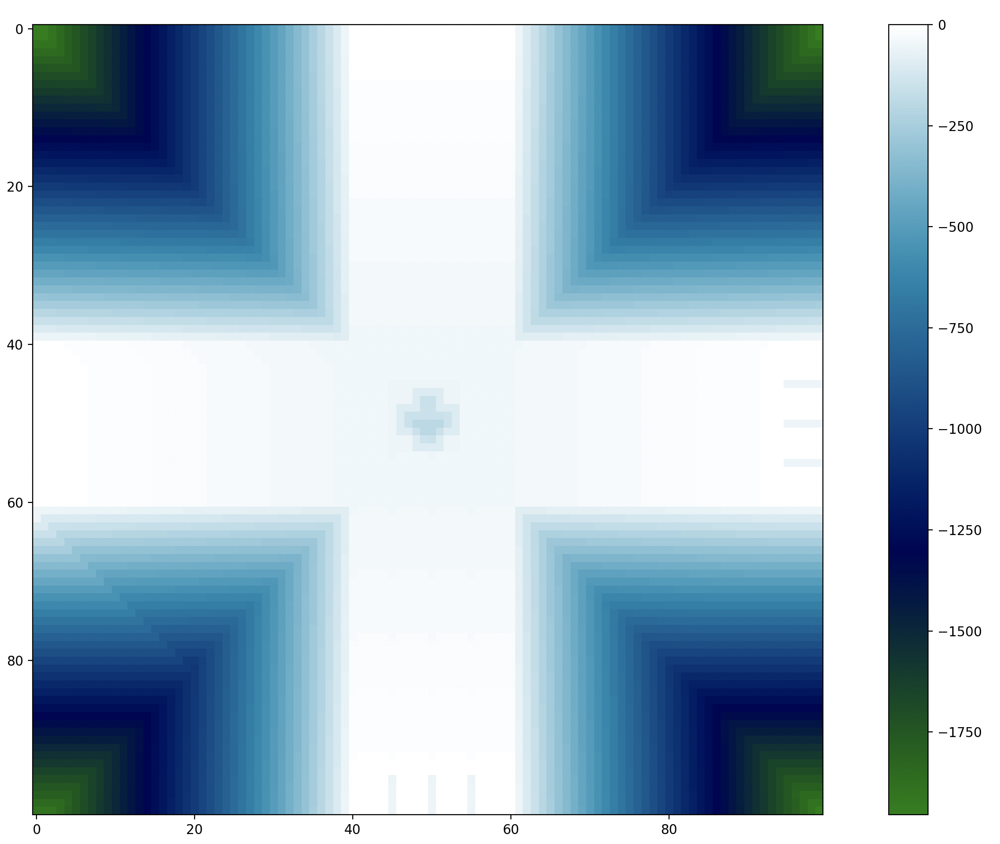

# Markov-Decision-Proccess 
## Documentation of BackPropagation Model to solve Traffic problem



## What is this?
This project emulates a crossing with cars advancing in a map using Markovian Decission Processes.

## The map
The map is a matrix. 
The map is composed of numbers. Each number means something different:

- 0 is a building block 🧱
- 1 is a piece of street 🛣️
- 3 is a car 🏎️
- 4 is a temporary barrier 🚦 

This is a map made out of these numbers:


## The Goal
The goal is to manage the cars crossing the map to have the less traffic possible
Markov Decision process(MDP) is a framework used to help to make decisions on a stochastic environment. 
Our goal is to find a policy, which is a map that gives us all optimal actions on each state on our environment. 
MDP is somehow more powerful than simple planning, because your policy will allow you to do optimal actions 
even if something went wrong along the way. Simple planning just follow the plan after you find the best strategy.

## How to run

You gotta have: 
- python3 running in your computer.
- numpy ```pip install matplotlib```
- matplotlib ```pip install matplotlib```

How to run the project in mac command line: ```python3 mdp.py```

1. A policy will be created in aprox. 30 sets.

2. A window with the policy map will appear.

3. When closing the window the crossing will start functioning with the policy

4. The fuzzy indexes will be shown at the terminal

5. A text file will be created and constantly updated with the map of the crossing.

6. The crossing process doesn’t stop until closing the process at the terminal


## What is a State

Consider state as a summary (then called state-space) of all information needed to determine what happens next. There are 2 types of state space:

### World-State: Normally huge, and not available to the agent.

### Agent-State: Smaller, have all variables needed to make a decision related to the agent expected utility.


##Markovian Property

Basically you don't need past states to do a optimal decision, all you need is the current state s. 
This is because you could encode on your current state everything you need from the past to do a good decision. Still history matters...

## Environment

To simplify our universe imagine the grid world, here your agent objective is to arrive on the green block, and avoid the red block. Your available actions are:  ↑,↓,←,→

The problem is that we don't live on a perfect deterministic world, so our actions could have have different outcomes:

For instance when we choose the up action we have 80% probability of actually going up, and 10% of going left or right. Also if you choose to go left or right you have 80% chance of going left and 10% going up or down.

### Here are the most important parts:

#### States: A set of possible states  S 

#### Model:  T(s,a,s′)∴P(s′|s,a)  Probability to go to state  s′  when you do the action  a  while you were on state  s , is also called transition model.

#### Action:  A(s) , things that you can do on a particular state  s 

#### Reward:  R(s) , scalar value that you get for been on a state.

#### Policy:  Π(s)→a , our goal, is a map that tells the optimal action for every state

#### Optimal policy:  Π∗(s)→a , is a policy that maximize your expected reward  R(s) 

In reinforcement learning we're going to learn a optimal policy by trial and error.

## Solving MDPs with Dynamic Programming

As stated earlier MDPs are the tools for modelling decision problems, but how we solve them? In order to solve MDPs we need Dynamic Programming, more specifically the Bellman equation.

But first what is dynamic programming? Basically it's a method that divides a problem into simpler sub-problems easier to solve, it's just really a divide and conquer strategy.

Dynamic programming is both a mathematical optimization method and a computer programming method, but both of them follow this divide and conquer mechanism. 
But on mathematics it's often used as an optimization tool. On programming is often implemented with recursion and is used on problems like find the shortest 
path on a graph and generation sequences.

Also you may find a term called memoization which is something that computer people use to improve the performance of those divide-and-conquer algorithms by memorizing sub problems that were already calculated.

### Linguistic Variables:

Traffic(t) = {LigthTraffic, MediumTraffic, HeavyTraffic}

LigthTracffic = {0:160}

MediumTraffic = {161:480}

HeavyTraffic = {481: 800}


## MemberShip Function 

### x Axis corresponds to time (t), y Axis corresponds to degree of membership (𝜇)

### 𝜇lighttraffic: 𝑋 → [0,1]

### 𝜇Mediumtraffic: 𝑋 → [0,1]

### 𝜇Heavytraffic: 𝑋 → [0,1]

## This mapping is called degree of membership
Quantifies the degree of membership of the element in X to a given fuzzy set. 
In this case scenario X is the amount of cars over a given lane on a certain moment. As the value 𝜇n decreases or increases, 
so does the degree of membership of X to a certain fuzzy set.

## Knowledge Base of Rules

### LightTraffic(cars)= {1  if 0<=cars < 161, 0 if cars>=161}

### MediumTraffic(cars) = {0 if 161<cars>=481, 1 if 161<=cars<481}
  
### HeavyTraffic(cars) = {0 if 481<cars, 1 if 481<=cars<=800}

## References

Santos, L. (2018). Markov Decision process · Artificial Inteligence. Leonardoaraujosantos.gitbooks.io. Retrieved 17 July 2018, from https://leonardoaraujosantos.gitbooks.io/artificial-inteligence/content/markov_decision_process.html
